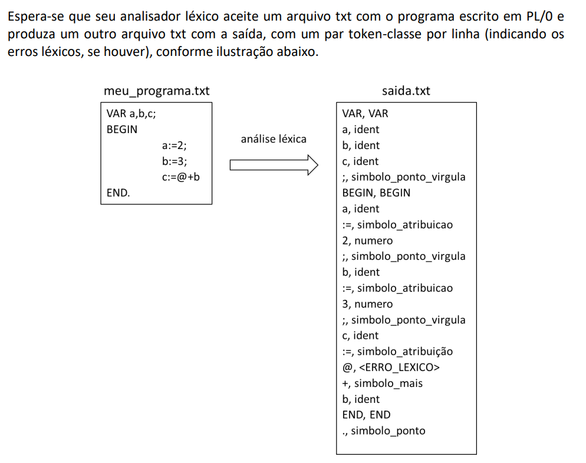

# Construção de um Compilador usando C - Etapa 1: Analisador Léxico


## Descrição do Projeto
Este projeto envolve o desenvolvimento de um compilador em C, focado especificamente na etapa de análise léxica. O compilador foi projetado para analisar a linguagem de programação PL/0. A análise léxica é uma etapa fundamental no processo de compilação, responsável por converter o texto de entrada em uma sequência de tokens que serão utilizados na análise sintática subsequente.

O analisador léxico desenvolvido neste projeto lê um arquivo de texto contendo código em PL/0 e gera um arquivo de saída com os tokens identificados, juntamente com suas classes. Além disso, o analisador reporta quaisquer erros léxicos encontrados durante o processamento.

## Estrutura do Repositório
- `main.c`: Código fonte do analisador léxico em C.
- `Makefile`: Arquivo de configuração para compilação do projeto.
- `Relatorio.pdf`: Relatório detalhado do projeto contendo decisões de projeto, diagramas de autômatos, instruções de compilação e execução, e exemplos de saída.

## Tecnologias Utilizadas
- **Linguagem de Programação C**: Utilizada para implementar o analisador léxico.
- **JFlap**: Ferramenta utilizada para desenhar e testar os autômatos finitos.
- **GCC (Linux/macOS) ou MinGW (Windows)**: Compilador utilizado para compilar o código fonte.
- **Visual Studio Code**: Editor de texto utilizado no desenvolvimento do código.

## Autômatos Implementados
1. **Autômato para Comentários**: Reconhece e ignora comentários delimitados por `{` e `}`.
2. **Autômato para Espaços**: Ignora espaços em branco no código.
3. **Autômato para Vírgulas**: Identifica e processa vírgulas.
4. **Autômato para Alfanuméricos**: Processa identificadores e palavras-chave.
5. **Autômato para Números**: Identifica sequências numéricas.
6. **Autômato para Símbolos e Operadores**: Reconhece operadores simples e compostos, e símbolos diversos.

## Instruções de Compilação e Execução
### Requisitos do Sistema
- Compilador de C: GCC (Linux/macOS) ou MinGW (Windows).
- Editor de texto: Qualquer editor de texto para editar e analisar o código.
- Terminal ou Prompt de Comando: Para executar comandos de compilação e execução.

### Passos para Compilar e Executar
1. **Baixar os arquivos `main.c` e `Makefile` e colocá-los no mesmo diretório**.
2. **Abrir o terminal (Linux/macOS) ou prompt de comando/powershell (Windows)**.
3. **Navegar até o diretório onde os arquivos foram salvos**.
4. **Compilar o Código**:
    ```bash
    make
    ```
    - Este comando utiliza o Makefile para compilar o código e gerar o executável.
5. **Executar o Analisador Léxico**:
    - Certifique-se de ter um arquivo de texto com o código em PL/0 no mesmo diretório.
    - Execute o analisador léxico com o seguinte comando:
    ```bash
    make run INPUT=input.txt OUTPUT=output.txt
    ```
    - Onde `input.txt` é o arquivo contendo o código PL/0 e `output.txt` é o arquivo onde a saída será gravada.
  
  ## Contribuidores
    - Mateus Curtolo de Goes
    - Gustavo B. Sanchez
    - Matheus dos Santos Inês
